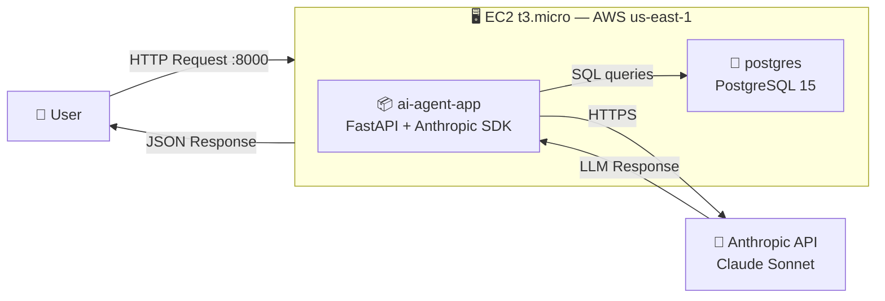

# Project 5 — AI Agent Deployment on AWS EC2

> **Data/AI/MLOps Engineering Portfolio**  
> Stack: AWS EC2 · Docker · FastAPI · PostgreSQL · Anthropic API

---

## Overview

This project takes the AI Agent built in [Project 2](../project-2-ai-agent) and deploys it to a production cloud environment on AWS EC2. The agent is publicly accessible via HTTP and runs fully containerized using Docker Compose — covering the full lifecycle from local development to cloud deployment.

**What I learned:**
- How to provision and configure an EC2 instance from scratch (Amazon Linux 2023)
- How to run a multi-container application in production using Docker Compose
- How to manage secrets securely (environment variables, `.gitignore`, no hardcoded keys)
- How to apply the least privilege principle with IAM users and custom policies
- How to expose a FastAPI service to the internet via security groups and port configuration

---

## Architecture



---

## Infrastructure

| Resource | Details |
|---|---|
| **Instance** | EC2 `t3.micro` — Amazon Linux 2023 |
| **Region** | `us-east-1` |
| **Public IP** | `98.81.193.111` |
| **Ports open** | `22` (SSH), `8000` (API) |
| **Storage** | EBS 8GB (default) |
| **Key pair** | `ai-agent-key.pem` |
| **Security group** | `ai-agent-sg` |

---

## Tech Stack

| Layer | Technology |
|---|---|
| Containerization | Docker + Docker Compose |
| API | FastAPI |
| Database | PostgreSQL 15 |
| LLM Integration | Anthropic SDK (Claude Sonnet) |
| Host OS | Amazon Linux 2023 |

---

## Project Structure

```
project-5-aws-deploy/
├── app/
│   ├── main.py           # FastAPI entrypoint
│   ├── agent.py          # AI Agent logic
│   └── tools/            # Tool definitions
├── docker-compose.yml
├── Dockerfile
├── .env.example          # Template — never commit .env
└── README.md
```

---

## Local Setup

### Prerequisites

- Docker + Docker Compose
- Anthropic API key

### Steps

```bash
# 1. Clone the repo
git clone https://github.com/your-username/project-5-aws-deploy.git
cd project-5-aws-deploy

# 2. Create your .env file
cp .env.example .env
# Fill in your values

# 3. Run
docker-compose up -d

# 4. Test
curl http://localhost:8000/docs
```

### Environment Variables

```env
POSTGRES_USER=your_user
POSTGRES_PASSWORD=your_password
POSTGRES_HOST=postgres
POSTGRES_DB=ai_agent_db
ANTHROPIC_API_KEY=sk-ant-...
```

> ⚠️ Never commit `.env` to Git. It's already listed in `.gitignore`.

---

## AWS Deployment

### 1. EC2 Setup

```bash
# Update packages
sudo dnf update -y

# Install Docker
sudo dnf install docker -y
sudo systemctl start docker
sudo systemctl enable docker
sudo usermod -aG docker ec2-user

# Install Git
sudo dnf install git -y

# Install Docker Compose
sudo curl -L "https://github.com/docker/compose/releases/latest/download/docker-compose-$(uname -s)-$(uname -m)" \
  -o /usr/local/bin/docker-compose
sudo chmod +x /usr/local/bin/docker-compose

# Install Docker Buildx (required for build)
mkdir -p ~/.docker/cli-plugins
curl -Lo ~/.docker/cli-plugins/docker-buildx \
  https://github.com/docker/buildx/releases/download/v0.17.0/buildx-v0.17.0.linux-amd64
chmod +x ~/.docker/cli-plugins/docker-buildx
sudo mkdir -p /usr/local/lib/docker/cli-plugins
sudo cp ~/.docker/cli-plugins/docker-buildx /usr/local/lib/docker/cli-plugins/
```

### 2. Deploy

```bash
# Clone and configure
git clone https://github.com/your-username/project-5-aws-deploy.git
cd project-5-aws-deploy
nano .env  # fill in values

# Run
docker-compose up -d

# Verify
docker-compose ps
```

### 3. SSH Access

```bash
ssh -i ~/.ssh/ai-agent-key.pem -t "TERM=xterm bash" ec2-user@98.81.193.111
```

---

## API Reference

| Method | Endpoint | Description |
|---|---|---|
| `GET` | `/docs` | Swagger UI |
| `GET` | `/health` | Health check |
| `POST` | `/chat` | Send message to AI Agent |

### Example Request

```bash
curl -X POST http://98.81.193.111:8000/chat \
  -H "Content-Type: application/json" \
  -d '{"message": "What is the current Bitcoin price?"}'
```

---

## IAM Configuration

| User | Policy | Purpose |
|---|---|---|
| `admin` | `AdministratorAccess` | Account management |
| `ai-agent-deploy` | Custom (EC2, S3 read) | Deployment only |

Follows the **least privilege** principle — the deploy user has only the permissions it needs, nothing more.

---

## Skills Demonstrated

- ✅ Cloud deployment on AWS EC2 (Amazon Linux 2023)
- ✅ Docker Compose orchestration in a production environment
- ✅ Security group and IAM configuration
- ✅ SSH key pair access management
- ✅ Secure environment variable handling (no secrets in Git)
- ✅ REST API exposure and architecture documentation

---

## Related Projects

- [Project 1 — ETL Pipeline with Airflow](../project-1-etl-airflow)
- [Project 2 — AI Agent with Anthropic API](../project-2-ai-agent)
- [Project 6 — Infrastructure as Code with Terraform](../project-6-terraform) *(next)*

---

*Part of a progressive Data/AI/MLOps Engineering portfolio.*
